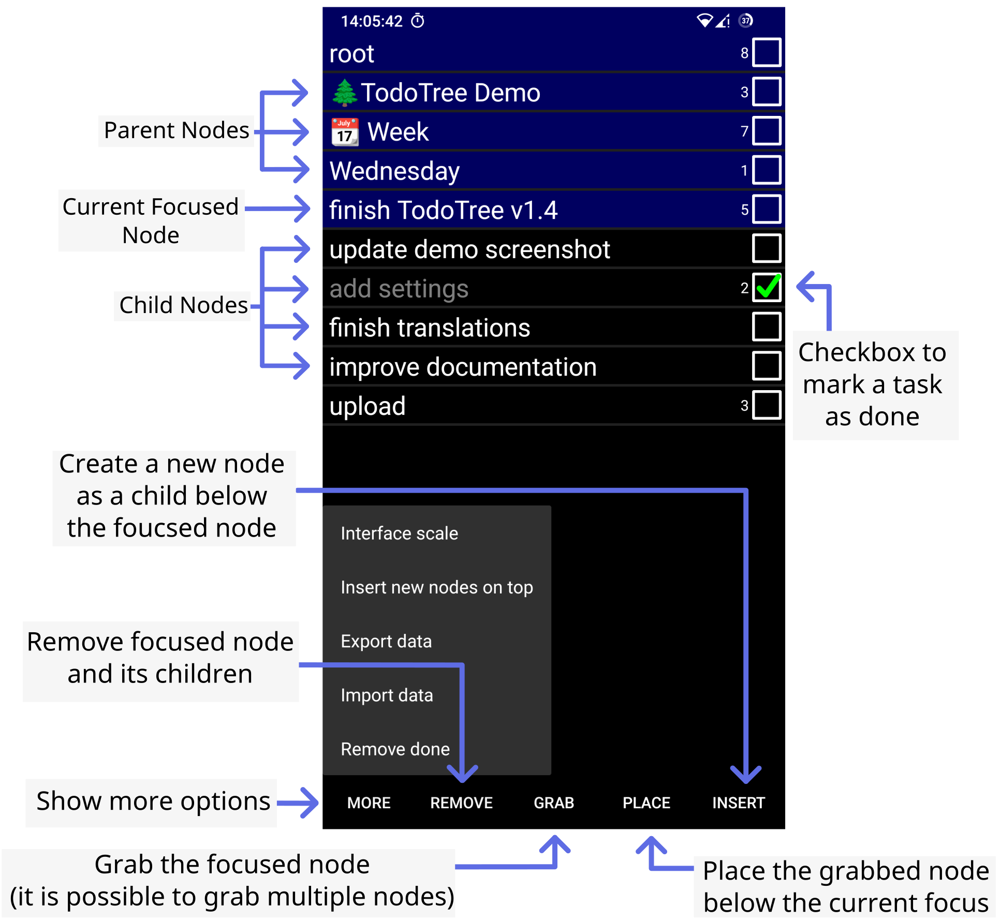

# TodoTree (Android App)

Keep your mind clear by quickly creating a nested tree of notes and tasks.

Some example usages of this app are:
* Creating quick notes on a given subject
* Exploring complicated ideas for potential projects.
* Maintain a list of tasks that have to be done
* Maintain a list of long term tasks with notes.
* Keep a groceries list

## Design

The whole interface is designed to allow for quick navigation of a deep and complicated tree of tasks and notes.
Adding tasks and notes is also very quick and easy.

In the above screenshot you can see that the current focused node is "TodoTree". This node contains a number of children:
* "Write the readme file"
* "publish on GitHub"
* "publish on fdroid"
* "add license file"

And a successive list of parents:
* "todo"
* "demo"
* "root"

In this case you can see that the parent node of "TodoTree" is "todo". But here the parent of "todo" is also visible, this is "demo".
And the parent of "demo" is also visible which is "root". This is the top most node. Each of these parent nodes can be visited by tapping on their name.

This list serves two purposes. The first is that it allows you to immediately see where exactly the current node is located.
The second purpose is that it allows you to immediately travel back to any level in the tree, making the navigation very quick.

Nothing will stand in your way from quickly navigating the tree and adding tasks and notes.

## Contributing
If you have an idea for a new feature or have found a bug, please [open an issue](https://github.com/TomSmeets/TodoTree/issues) on GitHub.

## Donation
If you'd like to support my work the please consider donating either on
[GitHub](https://github.com/sponsors/TomSmeets),
[Liberapay](https://liberapay.com/tsmeets) or
[PayPal](https://www.paypal.com/donate/?hosted_button_id=9FYM8Q5LXEFLY)

## License
TodoTree is licensed under the GPLv3 license. Please see the [license](LICENSE.txt) file for more details.
